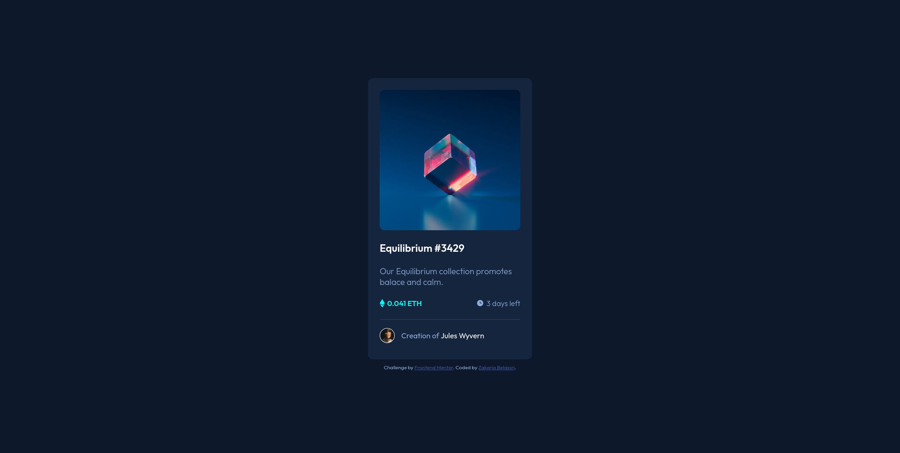

# Frontend Mentor - NFT preview card component solution

This is a solution to the [NFT preview card component challenge on Frontend Mentor](https://www.frontendmentor.io/challenges/nft-preview-card-component-SbdUL_w0U). Frontend Mentor challenges help you improve your coding skills by building realistic projects. 

## Table of contents

- [Overview](#overview)
  - [The challenge](#the-challenge)
  - [Screenshot](#screenshot)
  - [Links](#links)
- [My process](#my-process)
  - [Built with](#built-with)
  - [What I learned](#what-i-learned)
  - [Useful resources](#useful-resources)
- [Author](#author)

## Overview

### The challenge

Users should be able to:

- View the optimal layout depending on their device's screen size
- See hover states for interactive elements

### Screenshot

### Links

- Solution URL: [NFT preview card URL Solution](https://www.frontendmentor.io/solutions/nft-preview-card-component-using-css-flexbox-EDoJ0uiTyt)
- Live Site URL: [NFT preview card live site URL](https://zakariabelassri.github.io/nft-preview-card/)

## My process

### Built with

- Semantic HTML5 markup
- CSS custom properties
- Flexbox
- BEM Methodologie

### What I learned

Writing HTML and CSS using BEM naming

Creating states for intractive using CSS pseudo-class :hover

If you want more help with writing markdown, we'd recommend checking out [The Markdown Guide](https://www.markdownguide.org/) to learn more.

### Useful resources

- [CSS Reference - Pseudo-class :hover](https://tympanus.net/codrops/css_reference/hover/) - Helpful css reference to learn and practice hover pseudo-class.
- [BEM Methodologie - Quick start](https://en.bem.info/methodology/quick-start/) - The main bem website to learn the method.

## Author

- Frontend Mentor - [@zakariabelassri](https://www.frontendmentor.io/profile/zakariabelassri)
